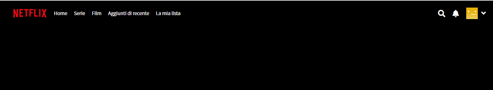
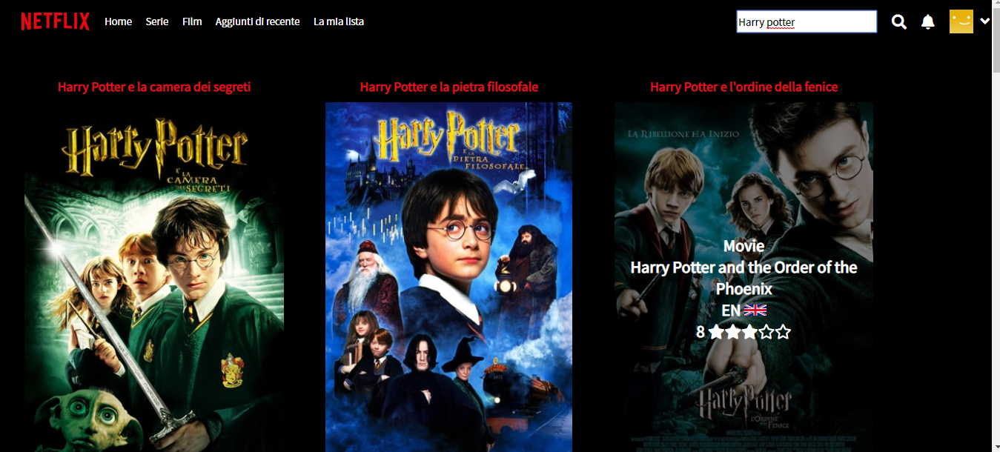
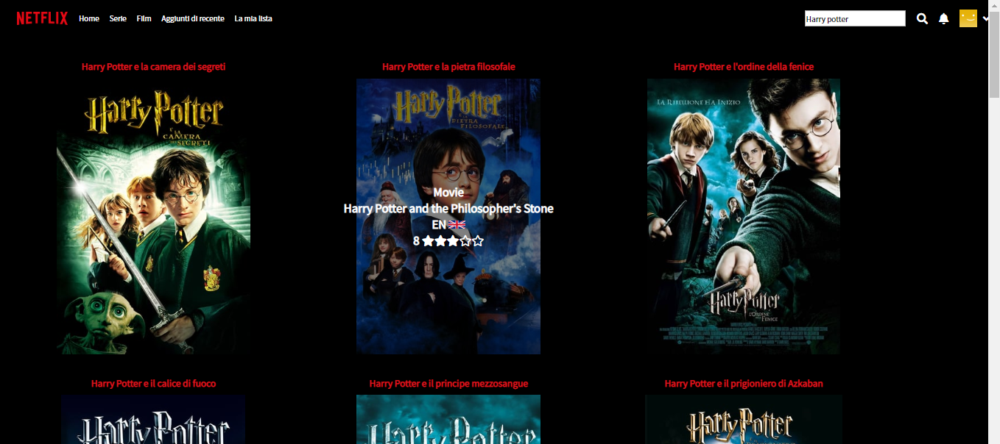
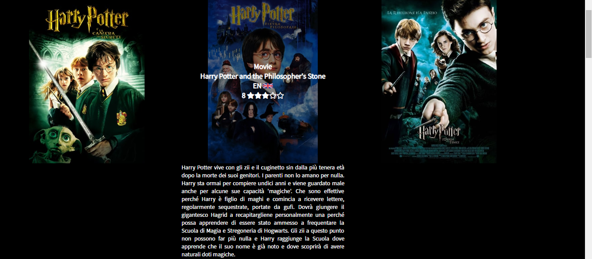

<h1> ##Boolflix </h1>

Boolflix è un progetto di replica della pagina di Netflix, mediante il quale si può effettuare la ricerca per titolo del film desiderato.
Con la ricerca nel database in questione si può accedere alla copertina del film.
Tramite un hover sopra la stessa si può accedere alle informazioni del film (Anno, valutazione, lingua originale ecc ecc).
Mediante un click sopra la copertina invece si può accedere a una breve trama. Con un altro click la stessa si richiude.

Tecnologie usate: HTML, CSS, JS, JQuery e chiamata AJAX.
Sono stati affrontati anche i seguenti argomenti: API, REST e abbiamo utilizzato il programma postMan per la gestione delle varie chiamate ajax.

<h4> ##Screenshots </h4>

   

  
